# Wormhole Raycasting Simulation

Simulacao 3D de wormholes com tres pipelines de renderizacao sobre a mesma cena: rasterizacao OpenGL classica, raycast/ray marching em CPU e raycast/ray marching em GPU (GLSL 1.20).

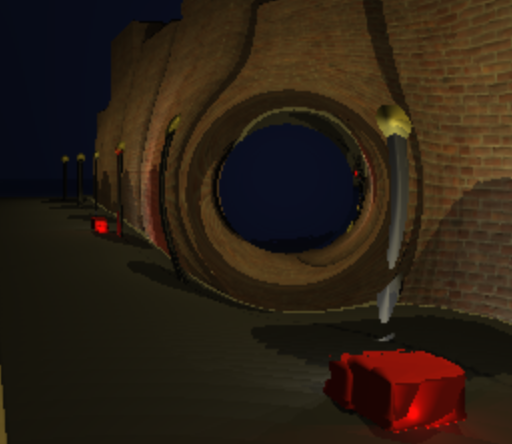

Disciplina: Introducao a Computacao Grafica - 2025.2

Equipe:
- Antonio Augusto Dantas Neto
- Joao Marcos Cunha Santos
- Kaique Bezerra Santos

## 1) O que e um wormhole no projeto

Em fisica, um wormhole e um atalho topologico no espaco-tempo (normalmente descrito em um contexto 4D). Neste projeto, isso e modelado de forma computacional por:

1. Campo de distorcao vetorial (warp field) ao redor de duas bocas A e B.
2. Curvatura de trajetoria dos raios de luz por integracao incremental desse campo.
3. Teleporte quando o raio cruza o nucleo de uma boca, saindo pela boca oposta.

Resultado visual: os raios se curvam perto do portal e podem atravessar de A para B (ou B para A), simulando a ideia de atalho espacial.

## 2) Interacao com luz: ray marching e raycast

O projeto combina SDF (Signed Distance Fields) com ray marching/raycast:

- Ray marching: avanco do raio por passos guiados pela distancia assinada da cena.
- Raycast no contexto do projeto: disparo de raios por pixel (camera -> cena), com intersecoes SDF e sombreamento.
- Iluminacao: Lambert (direcional do sol + luzes pontuais), ambiente, sombras por oclusao e ciclo dia/noite.
- Sky em grande distancia: gradiente procedural com variacao dia/noite e leve tint nas direcoes dos wormholes.
- Reflexo plano da agua/oceano: reflexao no plano infinito do chao (somente quando o hit e o plano principal), com mistura Fresnel.

### Comparacao visual (Raster x Raycast GPU x Prototipo 2D)

| Modo | Imagem de comparacao |
|---|---|
| Rasterizacao OpenGL | 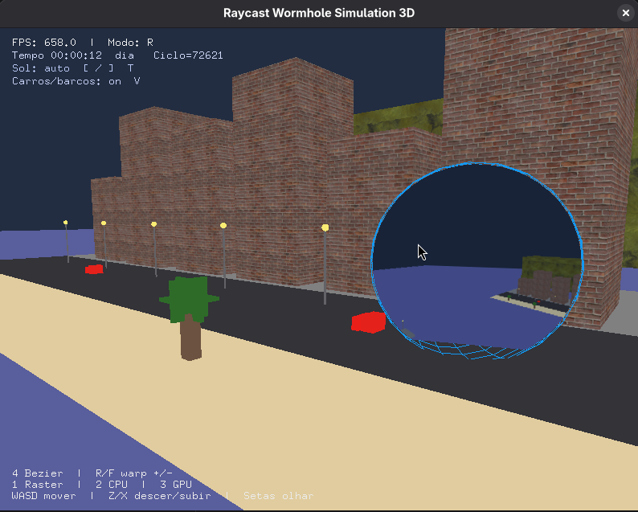 |
| Raycast GPU/GLSL | 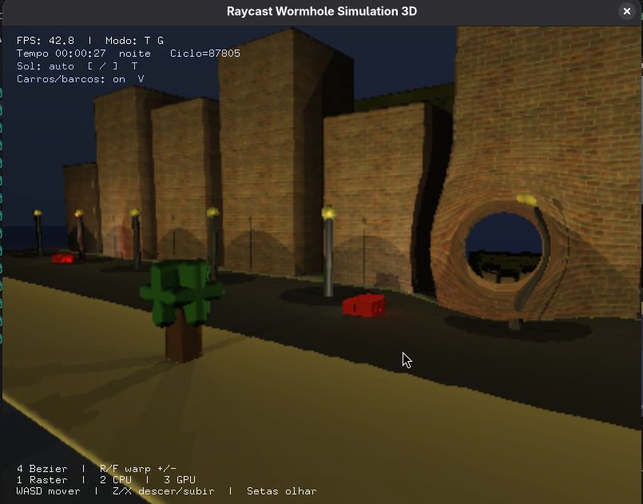 |
| Prototipo 2D (campo de deformacao) | 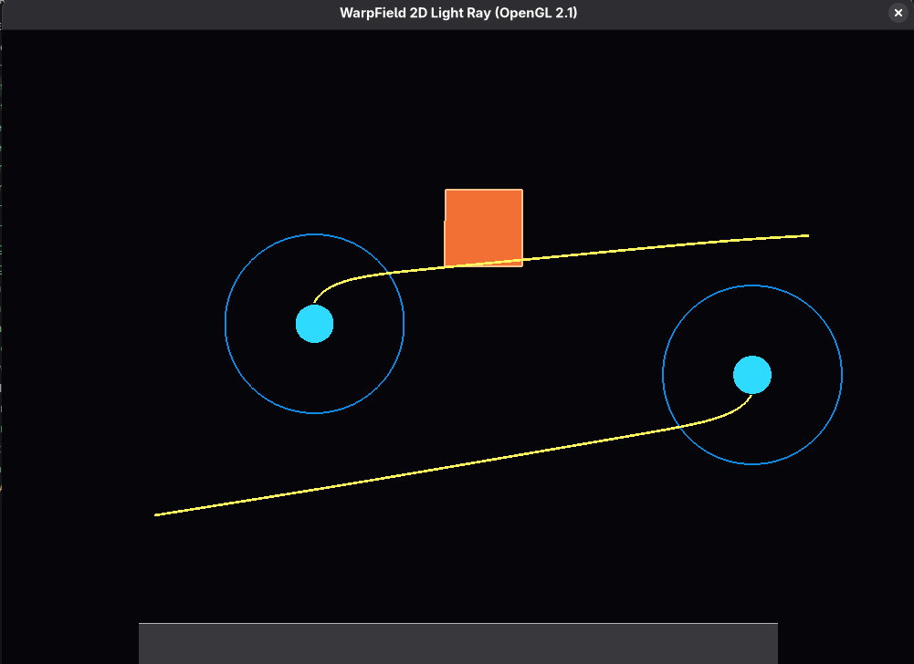 |

## 3) Estrutura do projeto

```text
ocean-engine/
├── wormhole-scene/            # Projeto principal 3D
│   ├── wormhole3d_main.cpp    # Entry point, loop GLUT, input e modo de render
│   ├── wormhole3d_globals.*   # Variaveis globais e estado compartilhado
│   ├── scene/                 # Montagem de cena, prefabs, elementos dinamicos, BVH
│   ├── simulation/            # Matematica, SDF, warp field, teleporte, traceRay
│   ├── raycast/               # Modo CPU e GPU (FBO + shaders)
│   ├── raster/                # Rasterizacao OpenGL e portais em FBO
│   ├── texture/               # Carregamento de texturas (stb_image/tinyexr)
│   ├── overlay/               # HUD (modo, FPS, ciclo do sol, etc.)
│   ├── audio/                 # Musica de fundo (mpv/ffplay)
│   ├── assets/                # Texturas e audio
│   └── Makefile
└── wormhole-2d/
    └── warp2d.cpp             # Prototipo 2D do campo de distorcao e teleporte
```

## 4) Definicao dos elementos da cena

### Primitivas base
- Esfera (`Sphere`)
- Caixa axis-aligned (`Aabb`)
- Ponto de luz 

### Elementos especiais e prefabs
Os prefabs geram combinacoes dessas primitivas e alimentam tanto raster quanto raycast:

- `BuildingPrefab`: predios (AABB)
- `PostPrefab`: poste de rua (AABB da haste + esfera da lampada)
- `DeckPostPrefab`: poste no conves do barco
- `TreePrefab`: tronco + folhagem com placas finas

### Elementos e composicao atual da cena
- Wormhole A na regiao urbana (rua)
- Wormhole B elevado na ilha distante (regiao do farol)

---
- Praia e rua (lajes AABB)
- Fileira de predios com texturas
- Postes com luz pontual
- Arvores em duas regioes (ilha principal e ilha distante)
- Montanhas ao fundo
- Carros dinamicos (duas caixas por carro + 4 luzes por veiculo)
- Barcos dinamicos orbitando o farol (geometria + luz de mastro)
- Farol (torre + cabeca com placas) com luz forte
- Esferas animadas em curvas de Bezier (passaros estilizados)

## 5) Movimentacao e animacao

- Camera:
  - Navegacao manual (WASD, Z/X, setas)
  - Voo cinematico por curva de Bezier (tecla 4)
- Carros: movimento em curva de Bezier com variacao de fase por faixa
- Barcos: orbita ao redor do farol com drift lateral
- Farol: cabeca gira com velocidade angular constante
- passaros: trajetorias Bezier independentes

## 6) Envio das primitivas para renderizacao

Pipeline de dados:

1. `sceneBuild()` monta `gSpheres`, `gBoxes`, `gPointLights`.
2. Atualizacao por frame (`sceneUpdateDynamicElements()`) move elementos dinamicos.
3. Mesmo conjunto de primitivas alimenta 3 modos:
   - Rasterizacao (`rasterScene()`)
   - Raycast CPU (`raycastSceneCpu()`)
   - Raycast GPU (`raycastSceneGpu()`) via textura de dados da cena + shader

Assim, a cena e unica, mas o backend de renderizacao muda por modo.

## 7) Estrutura das variaveis globais

Estado central compartilhado (`wormhole3d_globals.*`):

- Janela e render:
  - `gWindowWidth`, `gWindowHeight`
  - `gUseRaycast`, `gUseGpuRaycast`, `gRaycastGpuReady`
- Camera e animacao:
  - `gCamera`, `gAnimatingCamera`, `gCameraT`, pontos `P0..P3`
- Geometria da cena:
  - `gSpheres`, `gBoxes`, `gPointLights`
  - indices de objetos dinamicos (carros, barcos, farol, esferas Bezier)
- Wormholes:
  - `gWormhole.holeA`, `gWormhole.holeB` (centro, raio de warp, core, forca)
- Tempo e iluminacao:
  - `gSceneTimeMs`, `gSceneTimeSec`, `gDayNight*`
  - parametros do sol, ambiente e mistura noturna
- Otimizacao:
  - `gUseBvh` + BVH/bounding sphere na pasta `scene/`

## 8) Tres formas de renderizar os mesmos elementos

### 8.1 Rasterizacao
- OpenGL fixo/classico (GLUT)
- Objetos desenhados com malhas simples e texturas
- Portais renderizados em FBO e aplicados visualmente

### 8.2 Raycast CPU
- Render por software para buffer RGB
- `traceRay()` no lado CPU
- Exibicao com `glDrawPixels`

### 8.3 Raycast GPU (GLSL)
- Fragment shader GLSL 1.20
- FBO interno para o frame raycast
- Dados de objetos empacotados em textura
- Blit/compose para a janela
- Fallback automatico para CPU quando GPU/shader nao inicializa

## 9) Recursos visuais implementados

- Distorcao gravitacional (warp field)
- Teleporte entre bocas do wormhole
- Luz direcional com ciclo dia/noite
- Luzes pontuais (postes, farol, carros, barcos)
- Sombras por oclusao (sol e luzes pontuais)
- Reflexo plano no oceano com Fresnel
- Sky procedural para maxima distancia
- Portais na rasterizacao (FBO)
- Texturas em predios e montanhas
- Musica ambiente (`assets/ipanema.mp3`)

## 10) BVH e desempenho

Foi adicionada infraestrutura de BVH e bounding sphere para aceleracao espacial.

Situacao atual:
- A bounding sphere ja e usada para early-exit em rays longos.
- A BVH e reconstruida com a cena dinamica.
- O traversal completo da BVH no calculo de SDF CPU ainda esta em evolucao (ha fallback para iteracao completa dos objetos em alguns pontos).

Conclusao pratica observada no projeto: houve estudo e integracao de BVH, mas sem ganho expressivo adicional de performance no estado atual.

## 11) Processo de desenvolvimento

1. Prototipo 2D (`wormhole-2d/warp2d.cpp`):
   - Campo de deformacao
   - Curvatura de raio
   - Teleporte A <-> B
  - 
2. Prototipo 3D:
   - Testes de raycast/ray marching e SDFs
  - 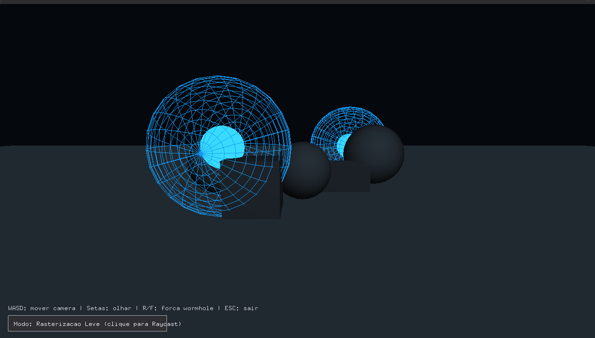
  - 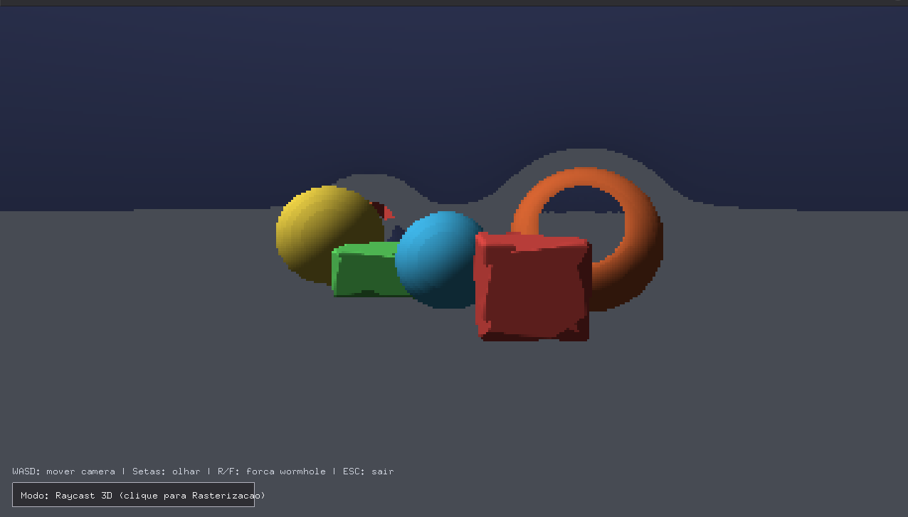
3. Migracao para GPU:
   - Shader GLSL com ray marching no fragment
  - 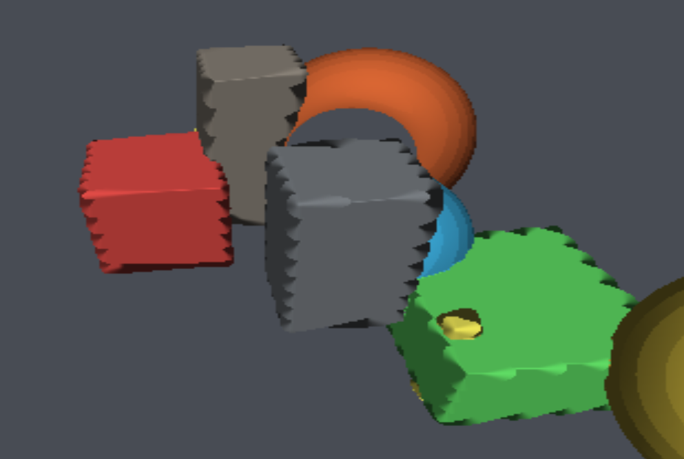
4. Iluminacao e sombras:
   - Lambert + oclusao
  - 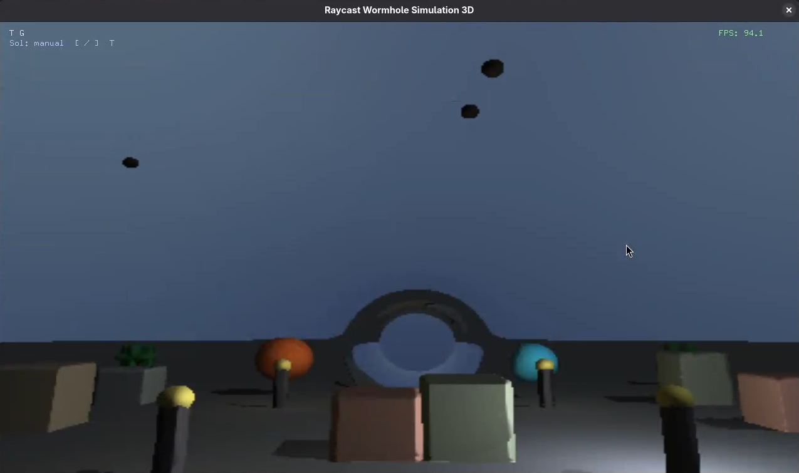
5. Reflexo plano da agua
  - 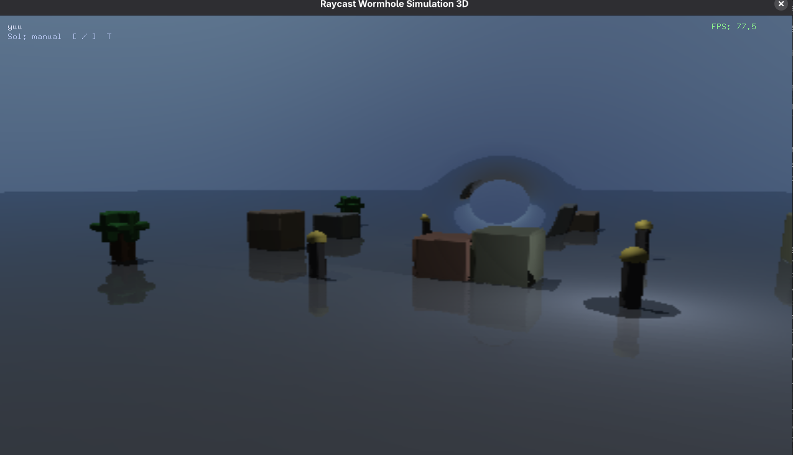
6. Criacao da cena final:
   - Praia, area urbana, ilha/farol, portais
  - 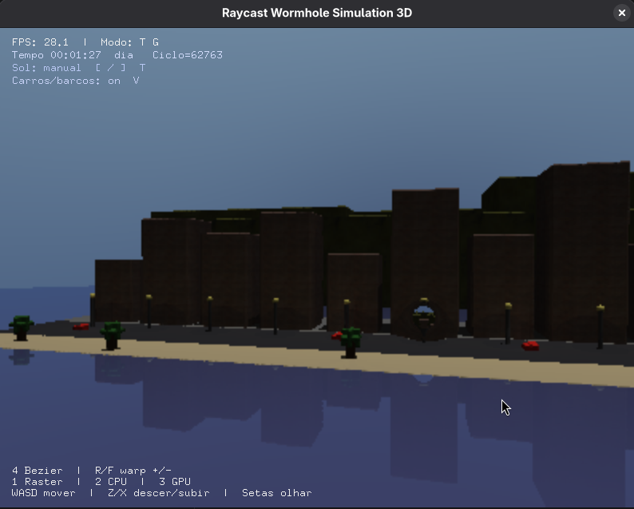
  - 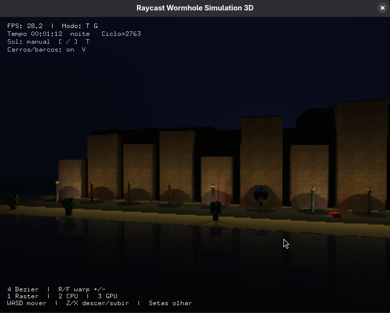
7. Elementos dinamicos:
   - Carros, barcos, passaro/esferas, farol giratorio
  - 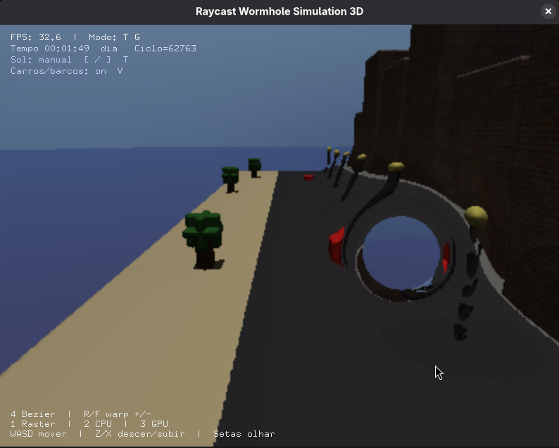
  - 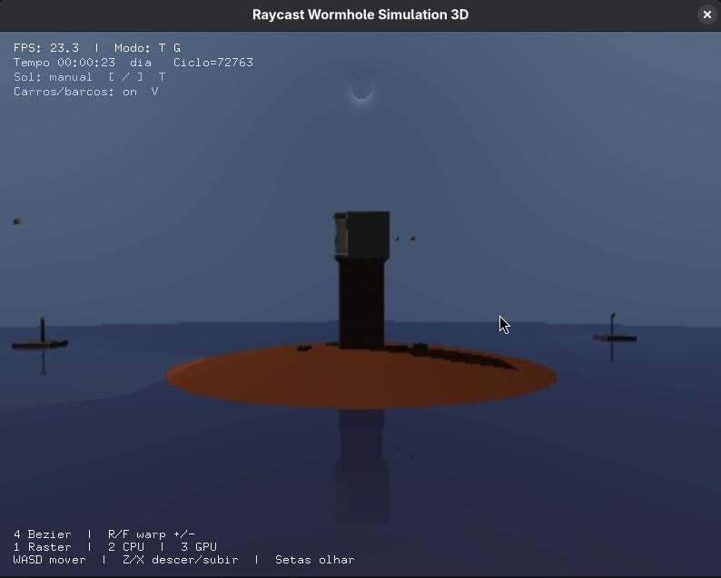
  - 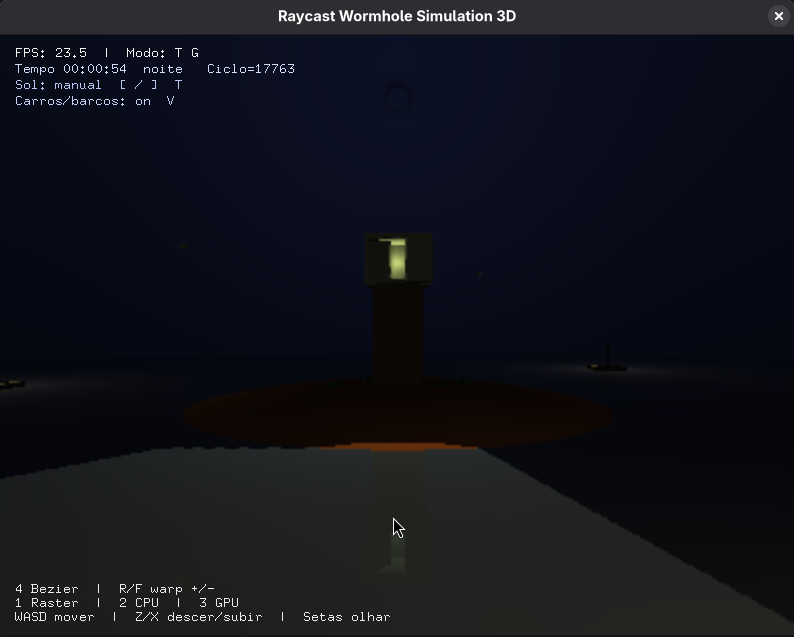
8. Integracao de textura e audio

### Modificar do efeito de warp

| Intensidade | Imagem |
|---|---|
| Warp menor | 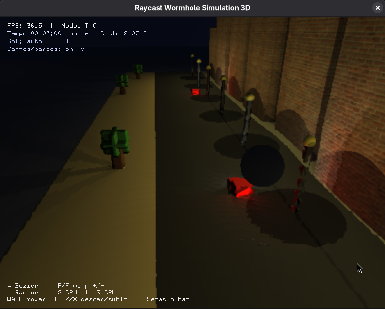 |
| Warp maior | 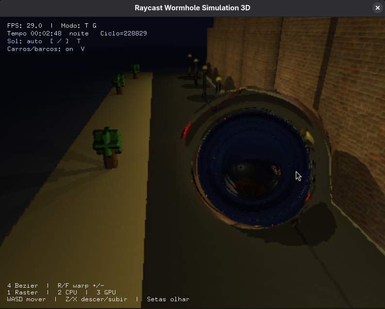 |

## 12) Build e execucao

### Demo 3D

```bash
cd wormhole-scene
make
./wormhole3d_demo
```

### Demo 3D (forcar GPU NVIDIA PRIME)

```bash
cd wormhole-scene
make run-nvidia
```

### Demo 2D

```bash
g++ wormhole-2d/warp2d.cpp -std=c++17 -O2 -Wall -Wextra -lGL -lGLU -lglut -o wormhole-2d/warp2d_demo
./wormhole-2d/warp2d_demo
```

### Dependencias

- C++17
- OpenGL 2.1
- GLSL 1.20
- freeglut
- libGL, libGLU, libdl, zlib

Ubuntu/Debian:

```bash
sudo apt install build-essential freeglut3-dev libglu1-mesa-dev zlib1g-dev
```

Fedora:

```bash
sudo dnf install gcc-c++ freeglut-devel mesa-libGLU-devel zlib-devel
```

Arch/Manjaro:

```bash
sudo pacman -S gcc freeglut glu zlib
```

## 13) Controles

| Tecla | Acao |
|---|---|
| WASD | Movimento no plano |
| Z / X | Descer / subir |
| Setas | Rotacao da camera |
| 1 | Rasterizacao |
| 2 | Raycast CPU |
| 3 | Raycast GPU |
| 4 | Toggle animacao Bezier da camera |
| R / F | Aumentar / diminuir forca do warp |
| [ / ] | Ajustar tempo manual do ciclo dia/noite |
| T | Alternar ciclo automatico/manual |
| V | Toggle de carros e barcos |

## 14) Requisitos da disciplina cobertos

Topicos aplicados no projeto (convergindo com as aulas de OpenGL/CG):

- Transformacoes e visualizacao 3D
- Pipeline de renderizacao
- Luz, cor e iluminacao
- Sombreamento
- Texturas
- Curvas parametricas (Bezier)
- Visibilidade e estrutura espacial (BVH)
- Animacao

## 15) Contribuicoes por membro

- Joao Marcos:
  - Raycast e integracao geral da cena
- Antonio:
  - Portais em rasterizacao e trabalho com texturas
- Kaique:
  - Estruturas BVH e ajustes de integracao

## 16) Problemas encontrados

- Animacao do farol precisou de ajustes de estabilidade
- Serrilhado/aliasing em objetos dentro da area de ray marching com warp intenso
- Repeticao de codigo no GLSL (oportunidade de refatoracao)

## 17) Metas futuras

- Montanhas mais organicas com superficie geometrica guiada por bump/height
- Otimizar verificacoes e traversal no raycast
- Melhorar anti-aliasing no raycast
